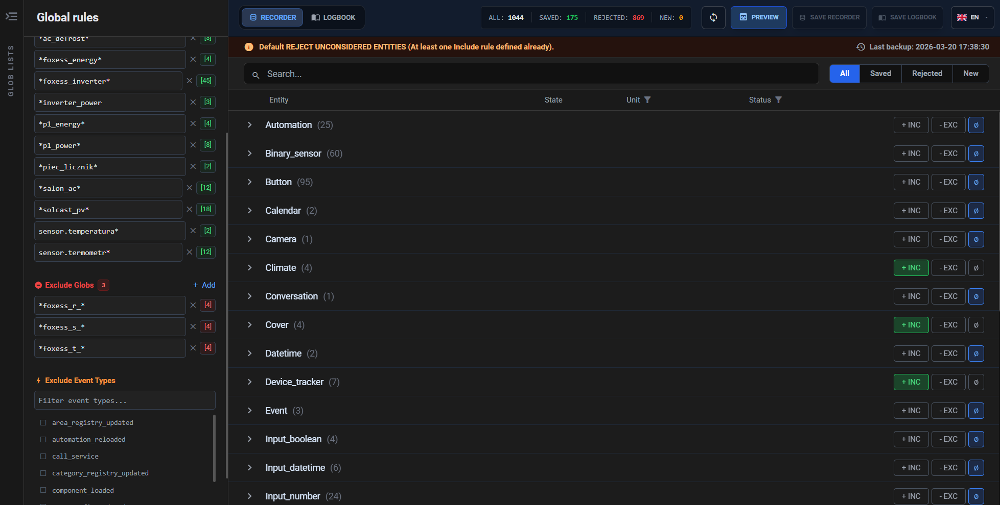
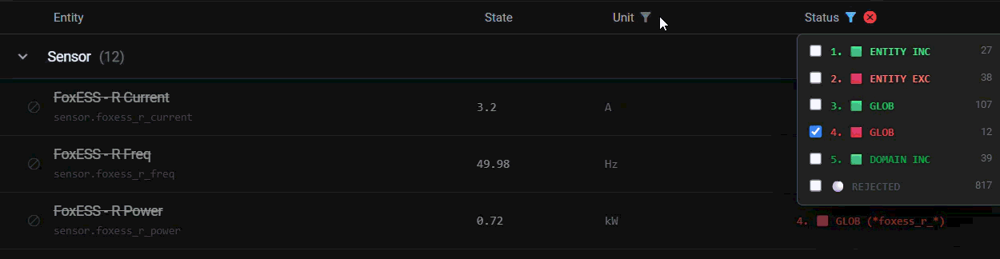

# 📼 Recorder Expert for Home Assistant

**Recorder Expert** is an advanced **GUI-based Home Assistant Add-on** designed to manage your `recorder` and `logbook` configurations without dealing with huge YAML files.

Instead of editing complex configuration manually, you can manage entity **includes, excludes, and globs** through a fast and responsive **React interface**.

---
[](https://my.home-assistant.io/redirect/hacs_repository/?repository_url=https://github.com/doniuuu/ha_recorder_expert)


# 📖 User Guide

## ✨ Features

### 🔄 Dual Mode Management
Seamlessly switch between managing **Recorder** and **Logbook** configurations.


### 🆕 New Entity Discovery
Recorder Expert automatically tracks entities you have already reviewed.

When Home Assistant discovers a new entity:
- it receives a **`NEW` badge**
- you can quickly decide whether it should be **recorded or ignored**

### 🔍 Smart Filtering
Filter entities by:

- **Domain**
- **State**
- **Unit of Measurement (UoM)**
- **Inclusion / Exclusion status**



### 🧩 Group Rules
Define rules for entire groups using:

- **Entity globs**  
  Example:
  ```
  sensor.*_power
  ```

- **Domains**

### 👻 Ghost Entity Detection
Automatically detects and cleans up:

- entities present in YAML
- but **no longer existing in Home Assistant**

### 💾 Backup Engine
Every save automatically creates a **backup** of your configuration.

You can:

- restore backups
- delete backups

directly from the UI.

### 🌍 Multi-Language Support
Fully localized UI.

Default languages include:

- 🇬🇧 English  
- 🇵🇱 Polish

---

# ⚙️ Installation & Setup

### 1️⃣ Add Repository
Add this repository to your **Home Assistant Add-on Store**.

### 2️⃣ Install Add-on
Install **Recorder Expert**.

### 3️⃣ Grant Permissions
The add-on requires access to your Home Assistant config directory:

```
/config
```

Make sure the add-on has **read/write access** in the **Supervisor UI**.

### 4️⃣ Start the Add-on
Start the add-on and open the **Web UI**.

---

# 🔗 Connecting to Home Assistant

To make Home Assistant use files generated by Recorder Expert, add the following to your `configuration.yaml`.

```yaml
recorder:
  another_configurable_keys: (keep 'db_url:' etc. in your current configuration.)
  include: !include recorder_expert/recorder_include_entities.yaml
  exclude: !include recorder_expert/recorder_exclude_entities.yaml

logbook:
  include: !include recorder_expert/logbook_include_entities.yaml
  exclude: !include recorder_expert/logbook_exclude_entities.yaml
```

⚠️ **Important**

Restart **Home Assistant** after making these changes.

---

# 🔄 Migrating Existing Recorder Configuration

If you already have a configured `recorder:` or `logbook:` section in your `configuration.yaml`, you can easily migrate it to Recorder Expert.

Simply copy your existing keys into the corresponding generated files.

Example of an existing configuration:

```yaml
recorder:
  include:
    entities:
      - sensor.power_total
    entity_globs:
      - sensor.*_energy
    domains:
      - sensor
```

You can move these values to:

```
/config/recorder_expert/recorder_include_entities.yaml
```

Example:

```yaml
entities:
  - sensor.power_total

entity_globs:
  - sensor.*_energy

domains:
  - sensor
```

You can do the same for:

```
recorder_exclude_entities.yaml
logbook_include_entities.yaml
logbook_exclude_entities.yaml
```

After copying your existing configuration, start **Recorder Expert** and the UI will load and manage your current rules.

This allows you to **continue working with your existing setup** while gradually managing it through the graphical interface.

---

# 🖥️ Supported Platforms

Recorder Expert is packaged as a **Home Assistant Add-on** and currently supports the following architectures:

| Platform | Architecture |
|--------|--------|
| Linux x86_64 | `amd64` |
| Raspberry Pi 4 / 5 | `aarch64` |
| Raspberry Pi 3 | `armv7` |
| Legacy x86 | `i386` |

This means the add-on works on most Home Assistant installations including:

- **Home Assistant OS**
- **Home Assistant Supervised**
- **Home Assistant running on Raspberry Pi**
- **Home Assistant running on x86 mini PCs / servers**

⚠️ The add-on requires **Home Assistant Supervisor** and therefore is **not supported on Home Assistant Container installations**.

# 🖥️ Using the Interface

### I / E / ∅ Buttons

| Button | Meaning |
|------|------|
| **I** | Force Include entity |
| **E** | Force Exclude entity |
| **∅** | Clear forced rule and use default policy |

---

### Policy Indicator

The top bar displays your current **implicit policy**.

If **any Include rules exist**, Home Assistant automatically switches to:

```
Reject All
```

Recorder Expert updates this state **in real time**.

---

### Preview / Save

Before writing configuration to disk you can:

1. Click **Preview / Save**
2. Review the generated **raw YAML**
3. Confirm the save

---

# 🧠 Technical Information

## 🏗 Architecture

Recorder Expert uses a **decoupled client-server architecture**.

### Backend
- **Python**
- **FastAPI**

Responsibilities:

- communicate with **Home Assistant Supervisor API**
- fetch real-time entity states
- manage file operations

---

### Frontend
- **React SPA**
- **TailwindCSS**

Runs entirely in the browser and communicates with the backend via **REST API**.

---

### YAML Parser

Uses:

```
ruamel.yaml
```

This ensures:

- safe YAML editing
- structure preservation
- correct formatting

---

# 📁 File Structure

All generated files are stored inside:

```
/config/recorder_expert/
```

### Recorder
```
recorder_include_entities.yaml
recorder_exclude_entities.yaml
```

### Logbook
```
logbook_include_entities.yaml
logbook_exclude_entities.yaml
```

### Entity Snapshot Files
Used by the **New Entity Discovery Engine**:

```
.recorder_known.json
.logbook_known.json
```

They track which entities existed during the last save.

### Backups
Automatic backups are stored in:

```
backups/
```

Each backup is stored as a **timestamped JSON configuration snapshot**.

---

# 🐳 Docker Context & Supervisor

The add-on requires the Home Assistant Supervisor to map the config directory.

Required mapping in `config.yaml`:

```yaml
map:
  - config:rw
```

---

### Startup Diagnostics

During boot, the add-on checks whether this file is accessible:

```
/config/configuration.yaml
```

If the container is isolated and the mapping is missing, a **severe error** will appear in the **Add-on logs**.

---

# 🌍 Localization (i18n)

Translations are dynamically loaded by the frontend from:

```
/lang/
```

### Adding a New Language

Create a new file:

```
lang/<language_code>.json
```

Example:

```
lang/de.json
lang/fr.json
```

The backend will **automatically detect new languages** and expose them in the UI.

---


# ❤️ Contributing

Contributions, bug reports, and feature requests are welcome.

Feel free to open an **Issue** or **Pull Request**.
